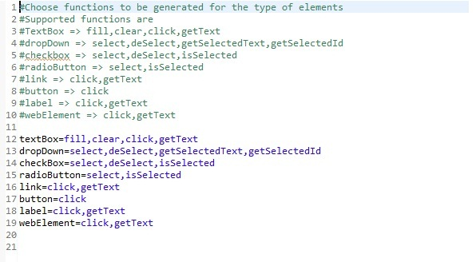
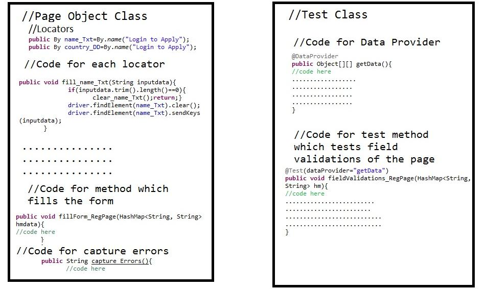
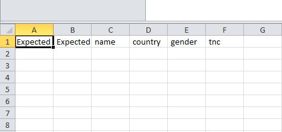

**Selenium Code Generator:**

Page Object pattern provides its host advantages like script maintainability, script legibility and clarity but at the same time, it needs too much of mundane and repetitive coding effort in creating page objects.

**Selenium Code Generator** automatically generates the code for Page Objects. We have been using this from past few years and it reduces hours of coding effort to minutes.

**Features:**

•	Generates code for Page Objects
•	Generates a method which is used to fill the form for a given page
•	Generates code for a method which captures error messages from a page
•	Generates a method which tests Field level validations of  a given page(using Data Provider)
•	Generates the Data Provider  for the Field level Validation method 

**Usage:**

*Step 1*:
•	Make sure you have java environment with ant configured on your machine.
•	Ant configuration details are available from http://ant.apache.org/manual/install.html

*Step 2*: Download the Project

*Step 3*: Config file changes
Go to your project folder and open config.properties file
According to your requirement, you can delete some/few method(s)  from config.properties file.

*Step 4*:
Go to class Input.java which is located in input package and do the following:
•	Change name of the page for which you want to generate code
•	Remove existing locators and paste the locators for which the Page Object methods  need to be generated

Your locators need to adhere following standards:

| Object  | Standard for name of the locator | Example |
| ------------- | ------------- | ------------- |
| Textbox  | LabelNameWIthoutAnySpaces_Txt  | By emailID_Txt = By.xpath("//input[@id='email']");  |
| DropDown  | LabelNameWIthoutAnySpaces_DD  | By years_DD = By.xpath("//select[@id='expyear']");  |
| Checkbox  | LabelNameWIthoutAnySpaces_Chk  | By tnc_Chk = By.xpath("//input[@name='tnc']");  |
| Radio button  | LabelNameWIthoutAnySpaces_Rd  | By user_Rd =   By.xpath("//input[@id='user'])";  |
| Link  | LabelNameWIthoutAnySpaces_Lnk  | By landlineNo_Lnk = By.xpath( "//a[@id='landline']");  |
| Button  | LabelNameWIthoutAnySpaces_Btn  | By joinNaukri_Btn =  By.xpath("//input[@value='Join Naukri.coml']");  |

*Step 5*:  Open terminal and change your current directory to this project location

*Step 6*: Run ant command. 
This will generate the code and the test data template/sheet in csv format

➢	Code will be generated in the following two files

1. ***SeleniumCodeGenerator\generatedCode\code_pom.txt***: 
This contains code for page object methods 
2. ***SeleniumCodeGenerator\generatedCode\code_fillform.txt***:  
This contains the code for following four methods:
•	**getData method**: acts as a dataprovider for test method field level validations. Paste this code in your test class
•	**fillform_pagename method** : method used to fill the provided page.
Paste this method in your page object class as shown below
•	**capture_Errors method**: method used to capture errors from page after filling the form. Paste this method in your page object class as shown below
•	**fieldValidations_pagename**: method to test field validations of the page. 
Paste this code in your test class as shown below

➢	Test data template will be as shown below, you can add data to this sheet.

**Contributors**
•	Omkar Kesa
•	Tarun Narula

**Contact Us**
Get in touch with us with your suggestions, thoughts and queries at engineering@naukri.com

**License**
Please see License for details